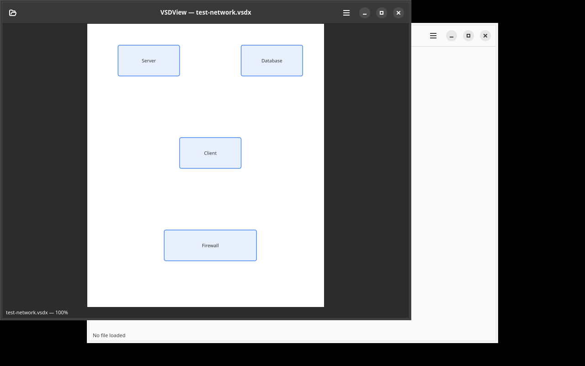

# VSDView

A minimal read-only viewer for Microsoft Visio files (.vsdx/.vsd), built with GTK4 and libadwaita.



## Requirements

- Python 3.10+
- GTK4, libadwaita, librsvg (GObject Introspection)
- Optional: libvisio (`vsd2xhtml`) for legacy .vsd files

## Installation

### macOS (Homebrew)

```bash
brew tap yeager/tap
brew install vsdview
```

### Ubuntu/Debian

```bash
# Add repository (one-time setup)
curl -s https://yeager.github.io/debian-repo/yeager.gpg | sudo tee /usr/share/keyrings/yeager.gpg > /dev/null
echo "deb [signed-by=/usr/share/keyrings/yeager.gpg] https://yeager.github.io/debian-repo stable main" | sudo tee /etc/apt/sources.list.d/yeager.list
sudo apt update

# Install
sudo apt install vsdview
```

### Fedora/RPM

```bash
sudo dnf install vsdview-0.1.7-1.noarch.rpm
```

### From source

```bash
pip install .
```

## Usage

```bash
vsdview [file.vsdx]
```

You can also drag and drop .vsdx/.vsd files onto the window.

## Keyboard Shortcuts

| Key | Action |
|-----|--------|
| Ctrl+O | Open file |
| Ctrl+Q | Quit |
| Ctrl+Plus | Zoom in |
| Ctrl+Minus | Zoom out |
| Ctrl+0 | Fit to window |
| F5 | Refresh |
| Ctrl+E | Export as PNG |
| Ctrl+/ | Keyboard shortcuts |

## Features

- Built-in .vsdx parser (no heavy dependencies)
- Optional libvisio support for legacy .vsd files
- SVG rendering via librsvg + Cairo
- Zoom (keyboard, Ctrl+scroll wheel)
- Light/dark theme toggle
- Drag and drop support
- Recent files list
- Export to PNG
- Desktop notifications for errors
- i18n ready (gettext)

## Translation

Translations are managed via [Transifex](https://www.transifex.com/danielnylander/vsdview/).

## License

GPL-3.0-or-later. See [LICENSE](LICENSE).

## Trademark Notice

Microsoft Visio is a registered trademark of Microsoft Corporation. VSDView is not affiliated with or endorsed by Microsoft.
