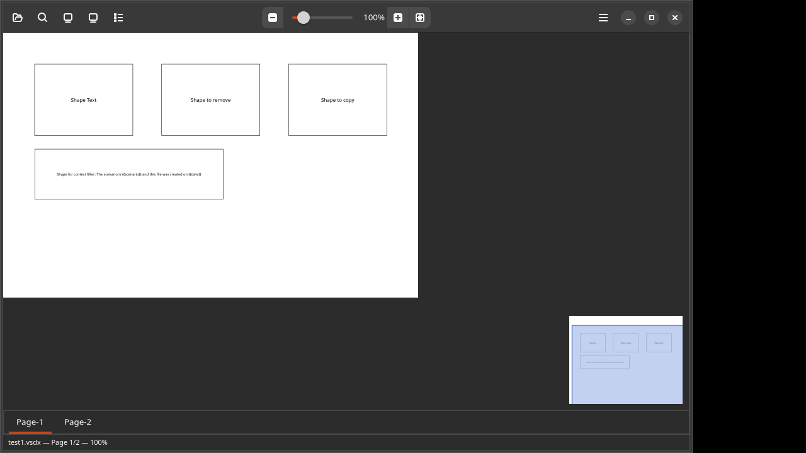

# VSDView

Read-only viewer for Microsoft Visio files (.vsdx/.vsd) with built-in renderer.

Built with GTK4/Adwaita. Part of the [Danne L10n Suite](https://github.com/yeager/debian-repo).

## Features

- **Multi-page viewing** — Tab bar for multi-page Visio documents, Ctrl+PageUp/PageDown navigation
- **Interactive zoom** — Scroll wheel zoom (Ctrl+scroll), pinch-to-zoom, +/- toolbar buttons, zoom slider, Ctrl+0 fit to window
- **Pan & drag** — Click and drag (middle mouse or Space+drag), arrow keys to pan
- **Text search** — Ctrl+F search bar with next/previous navigation (Enter/Shift+Enter), search across all pages
- **Shape info panel** — Click any shape to see its text, dimensions, position, properties, and metadata
- **Shape tree sidebar** — Hierarchical tree view of all shapes and groups, click to select
- **Measurement tool** — Toggle measurement mode, click two points to see distance in inches/mm
- **Export** — Export current page as PNG, PDF, SVG, or text; export all pages at once
- **Layer visibility** — Panel showing Visio layers with visibility toggles
- **Minimap** — Overview of entire document with viewport indicator, click to navigate
- **Drag & drop** — Drag .vsdx/.vsd files onto window to open them
- **Recent files** — Track recently opened files in the File menu
- **Dark/light background** — Toggle canvas background (system/light/dark)
- **Keyboard shortcuts** — Full set of keyboard shortcuts (Ctrl+? to view all)
- **Fullscreen** — F11 to toggle fullscreen

## Installation

### Debian/Ubuntu
```bash
sudo apt install vsdview
```

### Fedora/RPM
```bash
sudo dnf install vsdview
```

## License

GPL-3.0

## Author

Daniel Nylander — [danielnylander.se](https://danielnylander.se)

## Screenshots


